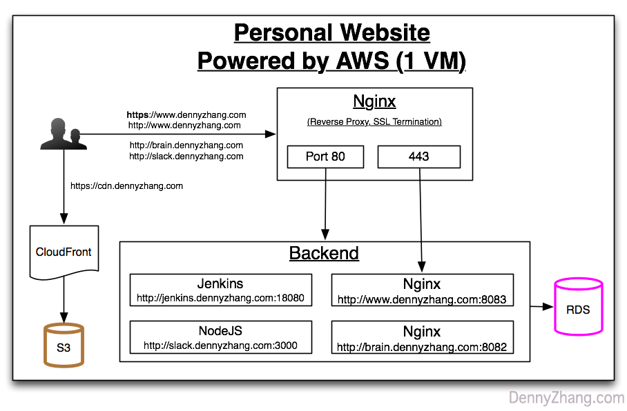
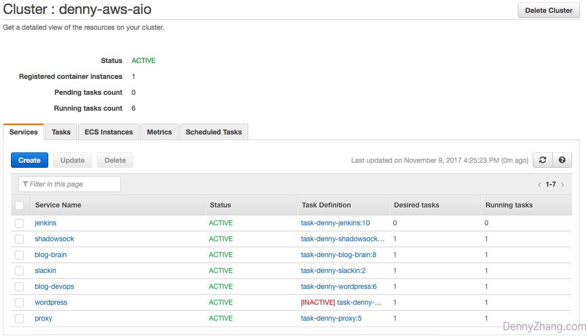

# aws-ecs-wordpress-study
<a href="https://github.com/DennyZhang?tab=followers"></a>

[](https://travis-ci.org/DennyZhang/aws-ecs-wordpress-study) [](http://makeapullrequest.com)

[](https://www.linkedin.com/in/dennyzhang001) [](https://www.dennyzhang.com/slack) [](https://github.com/DennyZhang)

File me [tickets](https://github.com/DennyZhang/aws-ecs-wordpress-study/issues) or star [the repo](https://github.com/DennyZhang/aws-ecs-wordpress-study).

Case study using AWS ECS to setup personal wordpress

Live Demo: https://www.dennyzhang.com

# Requirements
Case study using AWS ECS to setup personal wordpress
- [Optional] Fully HA
- [Optional] Security Hardening
- [Optional] Monitoring/Alerting




# Improvements Opportunities
- TODO: Avoid host nginx.conf in git repo
- TODO: wordpress docker image: no need to check-in image

End Users -> nginx
```
   80 -> http(8081)
   443 -> https(8441)
```

nginx -> backend
```
   http://www.dennyzhang.com:8081 -> 8083
   https://www.dennyzhang.com:8441 -> 8443
   http://slack.dennyzhang.com:8081 -> 3000
   http://brain.dennyzhang.com:8081 -> 8082   
```
## Nginx proxy

```
http://jenkins.dennyzhang.com:8081
http://slack.dennyzhang.com:8081
http://brain.dennyzhang.com:8081
```

```
- TODO
http://www.dennyzhang.com:8081
https://www.dennyzhang.com:8081
```

# TODO:
- TODO: avoid manually add xmlrpc_denny.php
- TODO: add nginx proxy server

# Use commands
```
docker pull denny/aws-ecs-wordpress-study:wordpress_v2 && \
docker pull denny/aws-ecs-wordpress-study:nginx && \
docker pull denny/devops-blog:latest
docker pull denny/devops-blog:nginx-proxy
```

# License
- Code is licensed under [MIT License](https://www.dennyzhang.com/wp-content/mit_license.txt).


